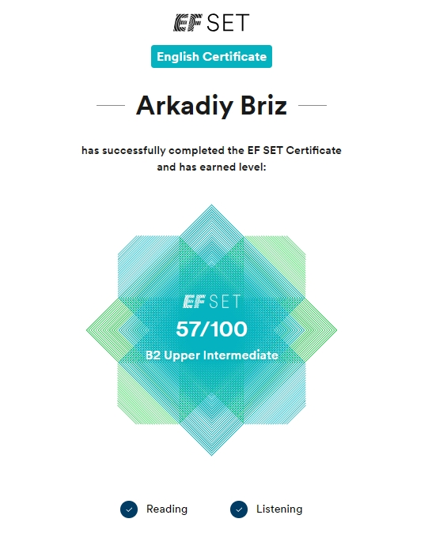

# Hi! I'm Arkady Briz!
## And I'm going to become a frontend developer.

### You can reach me on:
**Phone:** +79273133380\
**Email:** adbrizz@gmail.com\
**Discord:** arkbriz\
[**GitHub**](https://github.com/ArkBriz)

*****************************************

### Some words about myself

**How did I get into frontend development?**\
I graduated from a high school with a focus on physics and math, and then went on to study radio electronics at university, earning an engineering degree. But I never ended up working in that field. Instead, I spent the next five years in a management position at an organization. After that, I ran my own business for about four years, doing home and apartment renovation and finishing work.

So, how did I end up in frontend?
I’ve always been interested in computers since childhood, but it wasn’t until after I turned 35 that I finally decided to give programming a try. When the pandemic hit, I started looking for ways to work remotely. I learned how to build websites using no-code platforms — but that was more about design than development. I created a few websites, and later got a remote job as a mentor at an online education company. Alongside my main responsibilities, I sometimes edited HTML code for the learning platform. That’s when my childhood dream of working with code came back to life.

Three years as a mentor gave me solid experience with remote work and collaborating with teams and people online. That’s when I made the decision to become a frontend developer. I set a goal to learn programming no matter what — and here I am. What helps me on this path is my strong interest in the field, persistence, attention to detail, focus on goals and a healthy dose of perfectionism.

My motivation also comes from a few personal goals: working remotely and being location-independent, keeping my mind sharp, connecting with interesting and open-minded people, finally mastering English — and, well, let’s be honest, the salaries in tech aren’t bad either.

I enjoy learning new things and figuring out how the world works.


### About my skills:

* HTML
* CSS (SCSS, BEM)
* JS 
   - Basics (Variables, types, conditions, loops, objects, arrays, functions)
   - DOM API, Events
   - AJAX (fetch)
   - Basic Async JavaScript (Promise, async/await)
* React (Markup and styling of React components with JSX and styled-components)
* Gulp, NPM, Chrome DevTools
* CMS (Wordpress)
* Git
* Figma

**********************************************

### Code example:

Write a function that calculates the flight distance of a ship based on the input speed and flight time.
The speed is provided in knots, and the time in minutes. The output should be the distance in kilometers.

```
function travelDistance(avgSpeed, travelTime) {
  const KMH_PER_KNOT = 1.852;
  const travelHours = travelTime / 60;
  const travelSpeed = avgSpeed * KMH_PER_KNOT;
  const travelKms   = travelSpeed * travelHours;
  
  return travelKms;
}
```

### Study projects

1. [**Gllacy**](https://arkbriz.github.io/Gllacy/) (Static Layout, Flexbox, Grid Layout, Positioning, Forms, Popups, Sliders, Validation) - [GitHub](https://github.com/ArkBriz/Gllacy) 
2. [**Cat Energy**](https://arkbriz.github.io/Cat-Energy/) (Sass, BEM, Gulp, Responsive layout) - [GitHub](https://github.com/ArkBriz/Cat-Energy)
3. [**Berry**](https://arkbriz.github.io/berry/) (Sass, BEM, Gulp, Responsive layout) - [GitHub](https://github.com/ArkBriz/berry)
4. [**Kekstagram**](https://arkbriz.github.io/Kekstagram/) (JS: DOM API, Events, Sorting, Fetch API, Pristine) - [GitHub](https://github.com/ArkBriz/Kekstagram)
5. [**Cryptostars**](https://arkbriz.github.io/cryptostars/) (JS: Modules, Fetch, JSON, Pristine, Leaflet) - [GitHub](https://github.com/ArkBriz/cryptostars)


### Education

* Secondary education
* Higher engineering education in Radio Engineering
* Self-directed Frontend Developer Course at HTML Academy (in progress, almost finished)


### English
**Intermediate/Upper-Intermediate** (according to the 50m online test at [EF SET](https://www.efset.org/ef-set-50/))\

